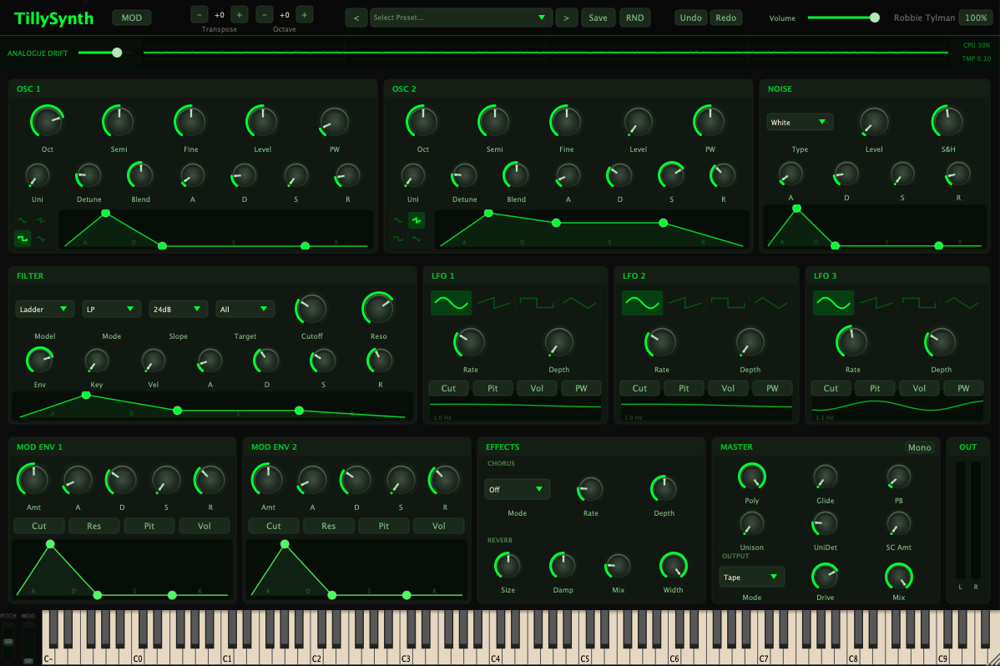

<div align="center">
  <h1>TillySynth</h1>
  <p><strong>The Warmth of Analogue, Driven by the Pulse of Your Machine.</strong></p>

  [](https://juce.com/)
  [](https://en.cppreference.com/w/cpp/17)
  []()
  [](LICENSE)
</div>

<div align="center">
  
</div>

---

**TillySynth** is a polyphonic subtractive synthesizer plugin designed to capture the lush, "organic imperfection" of vintage hardware, specifically inspired by the legendary Roland Juno-60.

Unlike static digital recreations, TillySynth feels alive. At its core is a unique **CPU-Temperature-Driven Analogue Drift Engine** that uses your computer's real-time hardware fluctuations to drive subtle per-voice pitch and filter variations. Every instance is unique, and every note evolves.

## ✨ Key Features

### 🎹 Living Oscillators
*   **16-Voice Polyphony**: Authentic voice-stacking with adaptive oldest-note-first stealing.
*   **Dual-Layer Synthesis**: Two independent main oscillators per voice with Sine, Sawtooth, Square (PWM), and Triangle waves.
*   **Noise Oscillator**: Dedicated noise source with White, Pink, and Sample & Hold modes.
*   **Unison Power**: Stack up to 7 voices per oscillator with adjustable detune spread and stereo blend.
*   **Analogue Detune**: A dedicated engine mapping CPU thermal data to ±8 cents of pitch drift and ±4 Hz of filter cutoff variation.

### 🎛️ Dynamic Sculpting
*   **Advanced Filter Models**: Modern, Vintage, and Ladder-style filters in Low-pass, High-pass, Band-pass, and Notch modes.
*   **Modulation Matrix**: 8-slot matrix for assigning LFOs, Envelopes, and MIDI controllers to dozens of destinations.
*   **Triple LFOs**: Three independent LFOs with multiple waveforms targeting pitch, filter, volume, and pulse width.
*   **Quad Envelopes**: Dedicated ADSR envelopes for Amplitude (x2), Filter, and two assignable Modulation envelopes.
*   **Sidechain Capability**: External sidechain input support for rhythmic ducking and pulsing effects.

### 🌈 Vintage Effects & Output
*   **1:1 Juno 60 Chorus Emulation**: Meticulous research went into emulating the famous Juno-60 chorus from scratch with classic I, II, and I+II modes.
    *   *Deep Dive:* [Understanding the Juno-60 Chorus](CHORUS/article/index.html) (`open CHORUS/article/index.html`)
    *   **Signal Flow (Juno-Style Chorus Pipeline):**
        ```mermaid
        flowchart TD
            %% Node Definitions
            In([Synth Voices L/R])
            Sum(Mono Sum)
            PreLPF[[Pre-BBD LPF<br/>8kHz 12dB/oct]]
            
            subgraph BBD_Network [Dual BBD Pipeline]
                BBD_L[BBD Delay L]
                BBD_R[BBD Delay R]
            end
            
            subgraph Mod_Engine [Modulation Engine]
                LFO[Shared LFO<br/>Tri/Sine]
                Invert[Phase Inversion<br/>180°]
                LFO --> Invert
            end
            
            OutLPF_L[[Post-Wet LPF L]]
            OutLPF_R[[Post-Wet LPF R]]
            Mix{Dry/Wet Mix}
            Out([Final Audio Output])
            
            %% Signal Connections
            In --> Sum
            Sum --> PreLPF
            PreLPF --> BBD_L
            PreLPF --> BBD_R
            
            LFO -- "+Depth" --> BBD_L
            Invert -- "-Depth" --> BBD_R
            
            BBD_L --> OutLPF_L
            BBD_R --> OutLPF_R
            
            OutLPF_L --> Mix
            OutLPF_R --> Mix
            In -. Dry Path .-> Mix
            
            Mix --> Out

            %% Styling (Boxes UI)
            classDef default font-family:system-ui,sans-serif;
            classDef io fill:#2d3436,color:#fff,stroke-width:2px,stroke:#000;
            classDef process fill:#6c5ce7,color:#fff,stroke-width:2px,stroke:#4834d4;
            classDef bbd fill:#d63031,color:#fff,stroke-width:2px,stroke:#b33939;
            classDef lfo fill:#0984e3,color:#fff,stroke-width:2px,stroke:#0652dd;
            classDef mixer fill:#00b894,color:#fff,stroke-width:2px,stroke:#019477;

            class In,Out io;
            class PreLPF,OutLPF_L,OutLPF_R process;
            class BBD_L,BBD_R bbd;
            class LFO,Invert lfo;
            class Mix mixer;
        ```
*   **Lush Reverb**: Integrated algorithmic reverb with room size, damping, and stereo width controls.
*   **Output Character**: Selectable "Vintage" and "Console" saturation modes for extra warmth and weight.
*   **Glide / Portamento**: Smooth pitch transitions for both monophonic and polyphonic patches.

### 🧪 Preset Curation Workflow
*   **Preset Review App**: A separate desktop app that loads every preset, plays a short audition hook, and lets you rate sounds from 1-5 stars.
*   **Inline Notes & Ratings**: Review notes are saved per preset so you can leave comments and revisit them later.
*   **Variant Generation**: Generate new user presets from promising sounds, keep the winners, and delete weak candidates.
*   **Visible Scoring Pass**: The review UI shows the full preset list with ratings, making iterative pruning much faster.

## 🛠️ Technical Stack

*   **Framework**: [JUCE 8.0.4](https://juce.com/)
*   **Language**: Modern C++17
*   **Build System**: CMake with [CPM.cmake](https://github.com/cpm-cmake/CPM.cmake)
*   **DSP Modules**: Custom voice manager with SIMD-ready oscillators and optimized filter models.
*   **Platform Integration**: 
    *   **macOS**: IOKit & CoreMotion for hardware telemetry.
    *   **Windows**: WMI-based thermal polling.
    *   *Graceful fallback to randomized PRNG drift if hardware sensors are unavailable.*

## 📐 Design Philosophy

TillySynth prioritizes **Visual and Sonic Character** over clinical precision.

*   **Custom UI with Oscilloscope**: A fully original, Juno-inspired horizontal layout featuring a real-time signal scope for visual feedback.
*   **Panel Wear**: Every plugin instance renders unique, randomized "surface wear" and "knob scuffs," emphasizing that no two units are the same.
*   **Input-Focused**: No generic preset browser—TillySynth encourages the lost art of sound design, making every patch a personal creation.

## 🚀 Getting Started

### Prerequisites
*   CMake (3.22+)
*   C++17 compatible compiler (Clang/MSVC)

### Build Instructions
```bash
# Clone the repository
git clone https://github.com/RobertTylman/TillySynth.git
cd TillySynth

# Configure and build
cmake -B build -S .
cmake --build build --config Release
```

The build will generate **VST3**, **AU** (macOS only), and **Standalone** versions of the plugin, plus the **TillySynth Preset Review** desktop app.

### Source Code Reference

For a file-by-file walkthrough of the entire `Source/` tree, see [docs/SOURCE_FILE_REFERENCE.md](docs/SOURCE_FILE_REFERENCE.md).

### Launching The Standalone Synth
```bash
open build/TillySynth_artefacts/Release/Standalone/TillySynth.app
```

### Launching The Preset Review App
```bash
open 'build/TillyPresetReview_artefacts/Release/TillySynth Preset Review.app'
```

---

*Designed and Developed by [Robbie Tylman](https://github.com/RobertTylman)*
