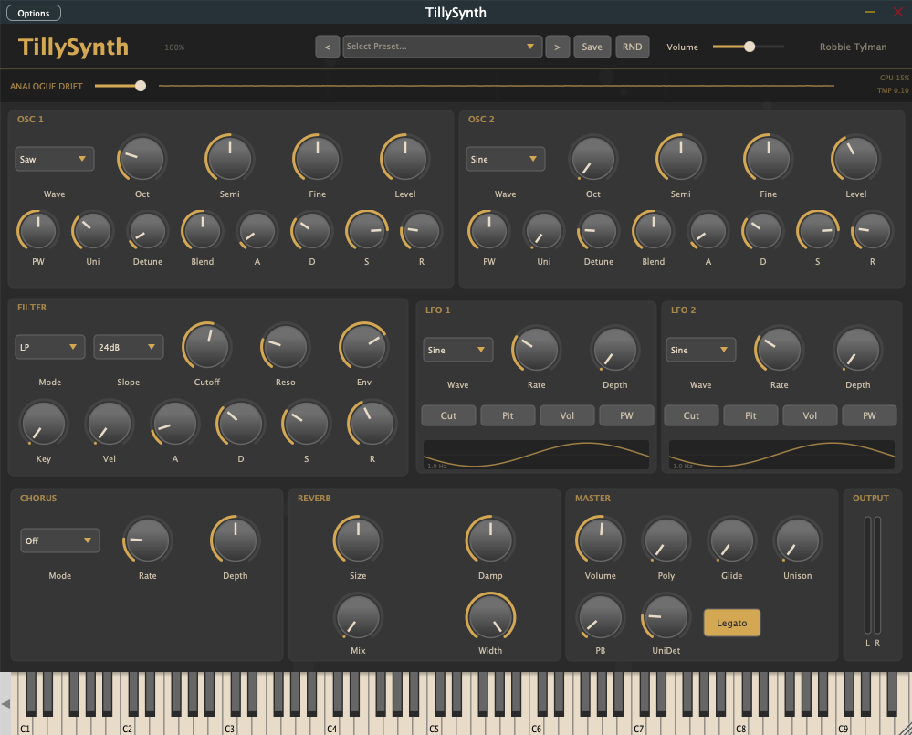

<div align="center">
  <h1>TillySynth</h1>
  <p><strong>The Warmth of Analogue, Driven by the Pulse of Your Machine.</strong></p>

  [](https://juce.com/)
  [](https://en.cppreference.com/w/cpp/17)
  []()
  [](LICENSE)
</div>

<div align="center">
  
</div>

---

**TillySynth** is a polyphonic subtractive synthesizer plugin designed to capture the lush, "organic imperfection" of vintage hardware, specifically inspired by the legendary Roland Juno-60.

Unlike static digital recreations, TillySynth feels alive. At its core is a unique **CPU-Temperature-Driven Analogue Drift Engine** that uses your computer's real-time hardware fluctuations to drive subtle per-voice pitch and filter variations. Every instance is unique, and every note evolves.

## ✨ Key Features

### 🎹 Living Oscillators
*   **16-Voice Polyphony**: Authentic voice-stacking with adaptive oldest-note-first stealing.
*   **Dual-Layer Synthesis**: Two independent oscillators per voice with Sine, Sawtooth, Square (PWM), and Triangle waves.
*   **Unison Power**: Stack up to 7 voices per oscillator with adjustable detune spread and stereo blend.
*   **Analogue Detune**: A dedicated engine mapping CPU thermal data to ±8 cents of pitch drift and ±4 Hz of filter cutoff variation.

### 🎛️ Dynamic Sculpting
*   **State-Variable Filter**: Low-pass, High-pass, Band-pass, and Notch modes with 12dB or 24dB slopes.
*   **Organic Modulation**: Dual independent LFOs targeting pitch, filter, volume, and pulse width.
*   **Precision Envelopes**: Dedicated ADSR envelopes for both Amplitude and Filter sections.
*   **Keyboard Tracking**: Filter cutoff scales with MIDI note and velocity for expressive, dynamic performances.

### 🌈 Vintage Effects
*   **BBD-Style Chorus**: A meticulously modeled Bucket Brigade Device chorus with classic I, II, and I+II modes. Captures the iconic "lushness" with subtle wow and flutter.
*   **Glide / Portamento**: Smooth pitch transitions for both monophonic and polyphonic patches.

### 🧪 Preset Curation Workflow
*   **Preset Review App**: A separate desktop app that loads every preset, plays a short audition hook, and lets you rate sounds from 1-5 stars.
*   **Inline Notes & Ratings**: Review notes are saved per preset so you can leave comments like "great attack" or "too harsh up top" and revisit them later.
*   **Variant Generation**: Generate new user presets from promising sounds, keep the winners, and delete weak candidates individually or in bulk.
*   **Visible Scoring Pass**: The review UI shows the full preset list with ratings and note previews, making iterative pruning much faster than bouncing between plugin windows and CSVs.

## 🛠️ Technical Stack

*   **Framework**: [JUCE 8.0.4](https://juce.com/)
*   **Language**: Modern C++17
*   **Build System**: CMake with [CPM.cmake](https://github.com/cpm-cmake/CPM.cmake)
*   **Tools**: JUCE plugin targets plus a standalone preset-review desktop app
*   **Platform Integration**: 
    *   **macOS**: IOKit & CoreMotion for hardware telemetry.
    *   **Windows**: WMI-based thermal polling.
    *   *Graceful fallback to randomized PRNG drift if hardware sensors are unavailable.*

## 📐 Design Philosophy

TillySynth prioritizes **Visual and Sonic Character** over clinical precision.

*   **Custom UI**: A fully original, Juno-inspired horizontal layout utilizing a custom `LookAndFeel`.
*   **Panel Wear**: Every plugin instance renders unique, randomized "surface wear" and "knob scuffs," emphasizing that no two units are the same.
*   **Input-Focused**: No generic preset browser—TillySynth encourages the lost art of sound design, making every patch a personal creation.

## 🚀 Getting Started

### Prerequisites
*   CMake (3.22+)
*   C++17 compatible compiler (Clang/MSVC)

### Build Instructions
```bash
# Clone the repository
git clone https://github.com/RobertTylman/TillySynth.git
cd TillySynth

# Configure and build
cmake -B build -S .
cmake --build build --config Release
```

The build will generate **VST3**, **AU** (macOS only), and **Standalone** versions of the plugin, plus the **TillySynth Preset Review** desktop app.

### Source Code Reference

For a file-by-file walkthrough of the entire `Source/` tree, see [docs/SOURCE_FILE_REFERENCE.md](docs/SOURCE_FILE_REFERENCE.md).

### Launching The Preset Review App
```bash
open 'build/TillyPresetReview_artefacts/Release/TillySynth Preset Review.app'
```

Use the review app to:
*   audition presets with built-in hooks
*   rate them 1-5 stars
*   leave notes for each preset
*   click any preset in the list to review it again
*   generate new user variants from strong presets
*   delete weak generated/user presets individually or in batches

Review ratings and notes are saved in your user application data folder, while generated presets are written to the normal TillySynth user preset directory.

---

*Designed and Developed by [Robbie Tylman](https://github.com/RobertTylman)*
